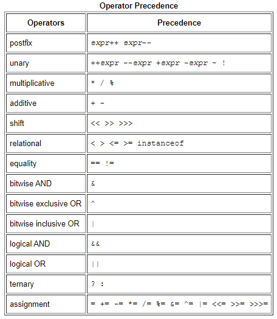

# Read: 01 - Java Basics

## Java Basics

- Variables
  - Instance variables (non static fields)
    - Fields declared **without** the static keyword and their values are unique to each instance of a class
  - Class variables (static fields)
    - A class variable is any field declared with the static modifier; this tells the compiler that there is exactly one copy of this variable in existence, regardless of how many times the class has been instantiated.
  - Local variables
    - Determination comes entirely from the location in which the variable is declared
  - Parameters
    - An important thing to remember is that parameters are always classified as "variables" not "fields".
    - Ex. ```public static void main (String[] args);``` args is the parameter to this method
  - Naming
    - Variable names should always avoid using ‘$’ and ‘_’.
    - When naming a variable, use full words instead of cryptic abbreviations
    - Follow camel syntax when naming variables with multiple words
- Operators
  - The closer to the top of the table an operator appears, the higher its precedence.
  - Operators with higher precedence are evaluated before operators with relatively lower precedence.
  - Operators on the same line have equal precedence.
    - All binary operators except for the assignment operators are evaluated from left to right
    - Assignment operators are evaluated right to left.
    - 
- Expression, statements, and blocks
  - An **expression** is a construct made up of variables, operators, and method invocations that evaluates to a single value.
    - When writing expressions, make sure to keep in mind the order of operations
  - A **statement** forms a complete unit of execution. The following types of expressions can be made into a statement by terminating the expression with a semicolon (;).
    - **Expression statements**
      - 
    - **Declaration statement** declares a variable
      - ```double aValue = 8933.234;```
    - **Control flow statement** regulates the order in which statements get executed
  - A **block** is a group of zero or more statements between balanced braces and can be used anywhere a single statement is allowed.
    - 
- Control flow statement
  - **Control flow statements** break up the flow of execution by employing decision making, looping, and branching, enabling your program to conditionally execute particular blocks of code.

## The first response in this Reddit thread on compiling

- When you compile code, the compiler (usually another program) takes the program the human wrote, and converts it into the program the computer can understand (i.e. converts from Java to machine language). The very short version could be, yes, compile means to make the code executable.
- This means the compiler they used checks to make sure their program is written correctly according to the rules of the programming language.

## XKCD: Compiling


## Reading Java Documentation

- [Java API Documentation](https://docs.oracle.com/javase/8/docs/api/)

[Back to README](README.md)
