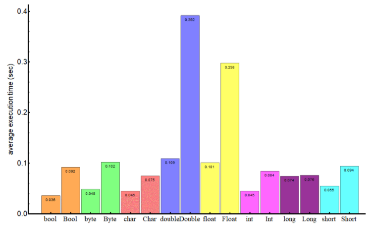

# Read: 03 - Maps, primitives, File I/O

## Primitives vs. Objects

- Every primitive type corresponds to a reference type.
- The **wrapper classes are immutable** and are final.
- The process of converting a primitive type to a reference one is called **autoboxing**, the opposite process is called **unboxing**.
  - Ex. ```Integer j  = 1; // autoboxing```
  - ```int i = new Integer (1); // unboxing```
- Pros and Cons of using primitive vs reference type based on **what application performance we try to achieve, how much available memory we have, the amount of available memory and what default values we should handle.**
  - Primitive type
    - Pro - Live on a stack and are accessed faster because less space
      - boolean – 1 bit
      - byte – 8 bits
      - short, char – 16 bits
      - int, float – 32 bits
      - long, double – 64 bits
    - Con - Arrays of the primitive types long and double consume more memory than their wrapper classes Long and Double.
    - Con - Single-element arrays of primitive types are almost always more expensive (except for long and double) than the corresponding reference type.
  - Reference type
    - Pro - Single-element arrays of reference types are cheaper
    - Con - Live on a heap and are relatively slow to access because occupies more space
      - Boolean – 128 bits
      - Byte – 128 bits
      - Short, Character – 128 bits
      - Integer, Float – 128 bits
      - Long, Double – 192 bits

- Default values
  - Default values of the primitive types are 0 for numeric types, false for the boolean type, \u0000 for the char type.
  - For the wrapper classes, the default value is null.
  - Need to check if primitive type variable is initialized while reference type variables are always null
- Usage
  - As we've seen, the primitive types are much faster and require much less memory. Therefore, we might want to prefer using them.
  - When our application needs collections with a big number of elements, we should consider using arrays with as more “economical” type as possible.

## Exceptions in Java (read the first three sections on the left: What is an Exception, The Catch or Specify Requirement, Catching and Handling Exceptions)

- What is an exception(exceptional event)?
  - An exception is an event, which occurs during the execution of a program, that disrupts the normal flow of the program's instructions.
- The Catch or Specify Requirement
  - This means that code that might throw certain exceptions must be enclosed by either of the following:
    - A try statement that catches the exception. The try must provide a handler for the exception.
    - A method that specifies that it can throw the exception. The method must provide a throws clause that lists the exception.
  - Code that fails to honor the Catch or Specify Requirement will not compile.
- The Three kinds of Exceptions
  - Checked Exception
    - These are exceptional conditions that a well-written application should anticipate and recover from.
  - Error
    - These are exceptional conditions that are external to the application, and that the application usually cannot anticipate or recover from.
  - Runtime Exception
    - These are exceptional conditions that are internal to the application, and that the application usually cannot anticipate or recover from.
- How to throw exceptions
  - All methods use the throw statement to throw an exception.
  - The throw statement requires a single argument: a throwable object.
  - Throwable objects are instances of any subclass of the Throwable class.

## Using Scanner to read in a file in Java

- Objects of type Scanner are useful for breaking down formatted input into tokens and translating individual tokens according to their data type.

[Back to README](README.md)
