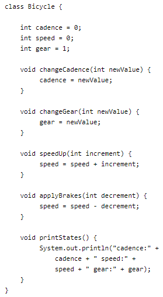
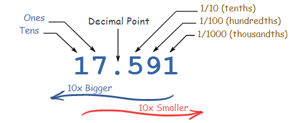
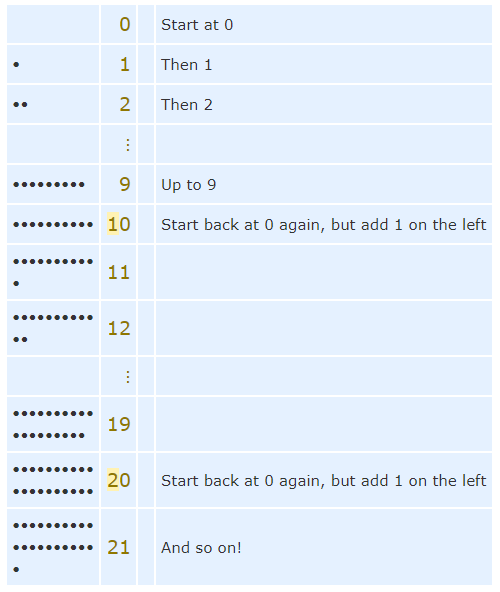
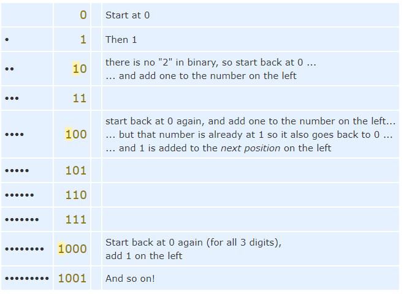
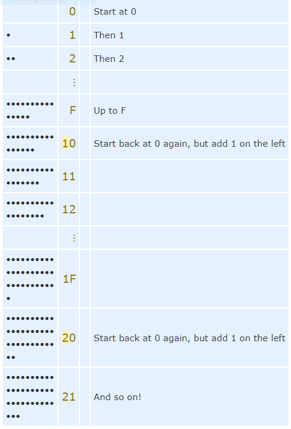

# Read: 04 - OOP

## Java OO Tutorial (only the Object and Class ones)

- Identifying the state and behavior for real-world objects is a great way to begin thinking in terms of object-oriented programming.
- An object stores its state in fields (variables in some programming languages) and exposes its behavior through methods (functions in some programming languages).
- Data Encapsulation
  - Hiding internal state and requiring all interaction to be performed through an object's methods
- Bundling code into individual software objects provides a number of benefits, including:
  - **Modularity**: The source code for an object can be written and maintained independently of the source code for other objects. Once created, an object can be easily passed around inside the system.
  - **Information-hiding**: By interacting only with an object's methods, the details of its internal implementation remain hidden from the outside world.
  - **Code re-use**: If an object already exists, you can use that object in your program.
  - **Pluggability and debugging ease**: If a particular object turns out to be problematic, you can simply remove it from your application and plug in a different object as its replacement.
- A **class** is the blueprint from which individual objects are created.

- The fields cadence, speed, and gear represent the object's state, and the methods (changeCadence, changeGear, speedUp etc.) define its interaction with the outside world.

## Java Classes (do NOT do the Nested Classes section)

- Within a bicycle class there are subclasses such as racing bikes, mountain bikes and tandem bikes which are subclasses of the bicycle class and inherit all the fields and methods of bicycle.
  - They even add  other fields and methods.

## Binary, Decimal and Hexadecimal Numbers

- Every digit in a decimal number has a "position", and the decimal point helps us to know which position is which

- Decimal Number System

- Binary Number System

- Hexadecimal Number System

- They look the same as the decimal numbers up to 9, but then there are the letters ("A',"B","C","D","E","F") in place of the decimal numbers 10 to 15.

[Back to README](README.md)
