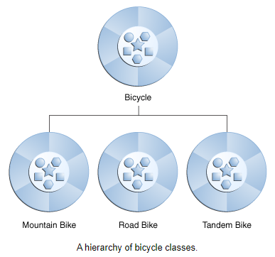
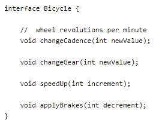

# Read: 06 - Inheritance and Interfaces

## Java OO Tutorial (review Object and Class, read the rest)

- Inheritance
  - Object-oriented programming allows classes to inherit commonly used state and behavior from other classes.
    - In this example, Bicycle now become the superclass of MountainBike, RoadBike, and TandemBike.
    - In the Java programming language, each class is allowed to have one direct superclass, and each superclass has the potential for an unlimited number of subclasses:

- 

  - At the beginning of your class declaration, use the extends keyword,  followed by the name of the class to inherit from:
    - Ex. ```class MountainBike extends Bicycle { }```
- Interface
  - A group of related methods with empty bodies.
  - To implement this interface, the name of your class would change, and you'd use the implements keyword in the class declaration

- 

- Package
  - A namespace that organizes a set of related classes and interfaces.
  - Application Programming Interface (API)
  - The Java Platform API Specification contains the complete listing for all packages, interfaces, classes, fields, and methods supplied by the Java SE platform
    - [Java Platform API Specification](https://docs.oracle.com/javase/8/docs/api/index.html)
- Summary
  - Real-world objects contain **state** and **behavior.**
  - A software object's state is stored in **fields.**
  - A software object's behavior is exposed through **methods.**
  - Hiding internal data from the outside world, and accessing it only through publicly exposed methods is known as **data encapsulation.**
  - A blueprint for a software object is called a **class.**
  - Common behavior can be defined in a **superclass** and inherited into a **subclass** using the **extends** keyword.
  - A collection of methods with no implementation is called an **interface.**
  - A namespace that organizes classes and interfaces by functionality is called a **package.**
  - The term API stands for **Application Programming Interface.**

[Back to README](README.md)
