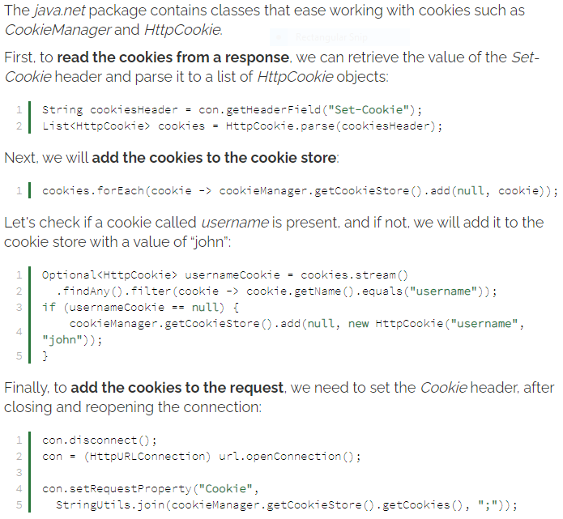

# Read: 09 - WRRC and Java

## Review: High-level HTTP

- Steps of HTTP Request Lifecycle:

1. Local Processing
2. Resolve an IP
3. Establish a TCP Connection
4. Send an HTTP Request
5. Tearing Down and Cleaning Up

- HTTP (Hyper*text **Transfer **Protocol) is an application-layer protocol that generally assumes use of TCP as its “transport-layer protocol.

## Java HTTP Request example

- The HttpUrlConnection class
  - Allows us to **perform basic HTTP requests without the use of any additional libraries.**
  - Disadvantage:
    - Code can be more cumbersome than other HTTP libraries
    - Does not provide more advanced functionalities such as dedicated methods for adding headers or authentication
- A HttpUrlConnection instance is created by using the openConnection() method of the URL class.

  - 

- If we want to add parameters to a request, we have to set the doOutput property to true, then write a String of the form param1=value¶m2=value to the OutputStream of the HttpUrlConnection instance:

  - 

- Adding headers to a request can be achieved by using the setRequestProperty() method:
  - ```con.setRequestProperty("Content-Type", "application/json");```
- To read the value of a header from a connection, we can use the getHeaderField() method:
  - ```String contentType = con.getHeaderField("Content-Type");```
- setConnectTimeout( ) and setReadTimeout( ) methods define the interval of time to wait for the connection to the server to be established or data to be available for reading.

- 

- Enable or disable automatically following redirects for a specific connection by using the setInstanceFollowRedirects() method with true or false parameter
  - ```con.setInstanceFollowRedirects(false);```

- 

- [Link to example for response on failed requests](https://www.baeldung.com/java-http-request#10-reading-the-response-on-failed-requests)
- [Link to build the Full Response](https://www.baeldung.com/java-http-request#11-building-the-full-response)

[Back to README](README.md)
