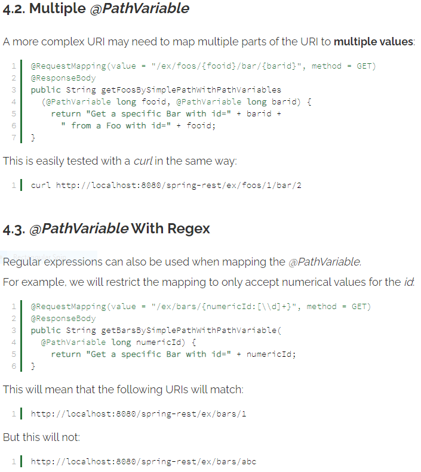

# Read: 12 - Spring RESTful Routing & Static Files

## Baeldung: Spring Request Mapping

## Spring guide: Accessing Data with JPA

Just read about the steps and will use it as a template when adding data.

## Baeldung: Comparing repositories

- Different kinds of Spring Data repository interfaces
  - CrudRepository
  - PagingAndSortingRepository
  - JpaRepository
- Each of these defines its own functionality:
  - CrudRepository provides CRUD functions
  - PagingAndSortingRepository provides methods to do pagination and sort records
  - JpaRepository provides JPA related methods such as flushing the persistence context and delete records in a batch
- CrudRepository

  - Simple and generic, but provides all basic query abstractions needed in an application
- PagingAndSortingRepository

  - Key for implementing pagination
  - Create Pageable object with certain properties:
    - Page size
    - Current page number
    - Sorting

- JpaRepository

  - Interface extends PagingAndSortingRepository which means it has all methods present in the CrudRepository as well.
- Downsides of using repositories
  - Be careful not to expose these internal implementation details
  - Extending CrudRepository exposes a complete set of persistence methods at one. In some circumstances this is not bad.

[Back to README](README.md)
