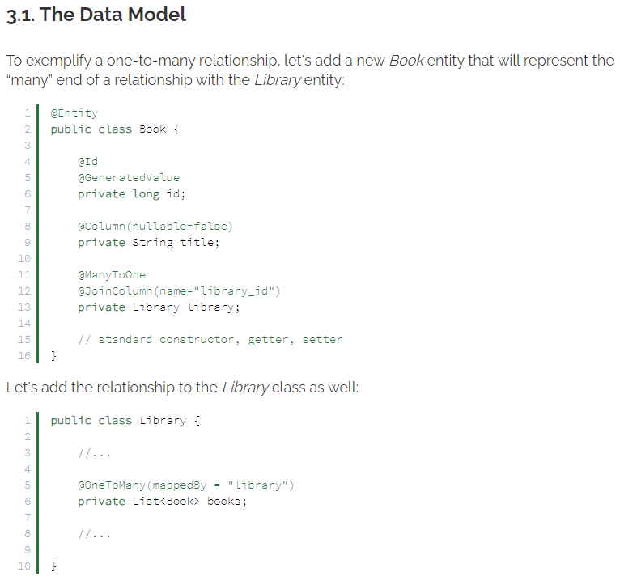

# Read: 13 - Related Resources and Integration Testing

## Related data in Spring (focus on the relationship annotations, not the curl requests)

- How to work with relationship between entities in Spring Data REST
  - One-to-One Relationship


- One-to-Many Relationship

- We also need to create a BookRepository:
  - ```public interface BookRepository extends CrudRepository<Book, Long> { }```
- Many-to-Many Relationship

- Let's create a repository interface to manage the Author entity:
  - ```public interface AuthorRepository extends CrudRepository<Author, Long> { }```
- Testing the Endpoints


## Baeldung: Spring Integration Testing

- Integration testing verifies the end-to-end behavior of a system
- Preparation

- Spring MVC Test Configuration

- WebApp Configuration
  - ```@WebAppConfiguration(value = "")```
- Web Application Context Object
  - ```@Autowired private WebApplicationContext wac;```

- Writing Integration Tests
  - [Examples of Integration Testing](https://www.baeldung.com/integration-testing-in-spring) section four
  - Verify View Name
  - Verify Response Body
  - Send GET Request With Path Variable
  - Send GET Request With Query Parameters
  - Send POST Request
- MockMvc Limitations
  - TestDispatcherServlet is responsible for calling controllers and performing all of the familiar Spring magic.
  - There are no real network connections made, and consequently, we won't test the whole network stack while using MockMvc.
  - Spring prepares a fake web application context to mock the HTTP requests and responses, it may not support all features of a full-blown Spring application.
