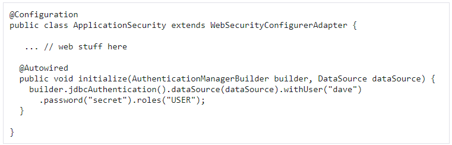
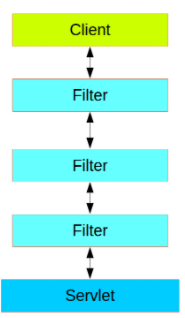
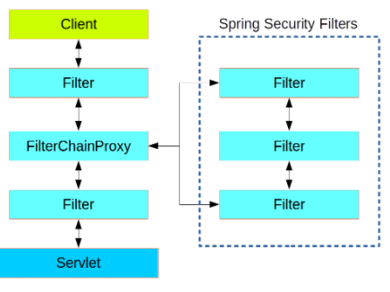

# Read: 16 - Spring Authentication

## Spring Security overview

- Application security boils down to two more or less independent problems:
  - authentication (who are you?)
  - authorization (what are you allowed to do?)
- The main strategy interface for authentication is AuthenticationManager which only has one method:

- An AuthenticationManager can do one of 3 things in its authenticate() method:
  - return an Authentication (normally with authenticated=true) if it can verify that the input represents a valid principal.
  - throw an AuthenticationException if it believes that the input represents an invalid principal.
  - return null if it can’t decide.
- The most commonly used helper is the AuthenticationManagerBuilder which is great for setting up in-memory, JDBC or LDAP user details, or for adding a custom UserDetailsService.
- Once authentication is successful, we can move on to authorization, and the core strategy here is AccessDecisionManager.
- The picture below shows the typical layering of the handlers for a single HTTP request.

Spring Security is a single physical Filter but delegates processing to a chain of internal filters

- There can be multiple filter chains all managed by Spring Security in the same top level FilterChainProxy and all unknown to the container.
  - The Spring Security filter contains a list of filter chains, and dispatches a request to the first chain that matches it

## Spring Auth cheat sheet

- [Spring Authentication Cheat Sheet](https://github.com/codefellows/seattle-java-401d2/blob/master/SpringAuthCheatSheet.md)

[Back to README](README.md)
