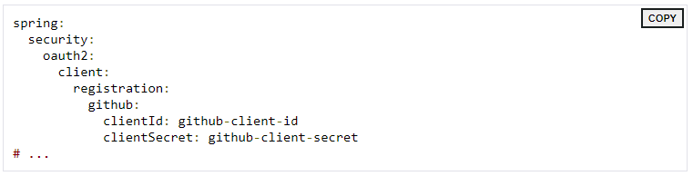
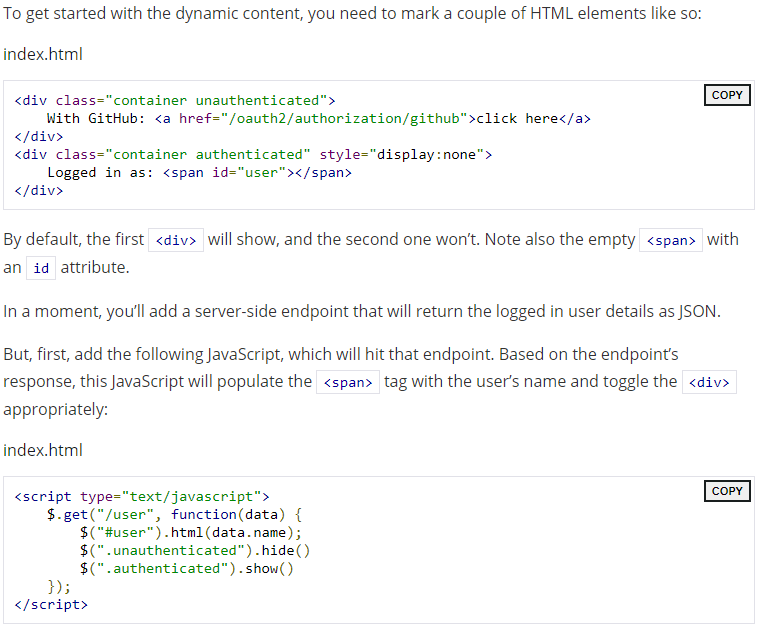
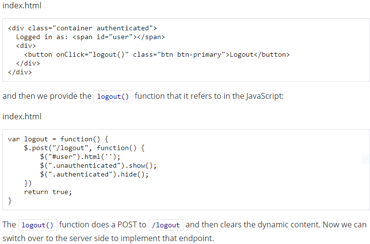
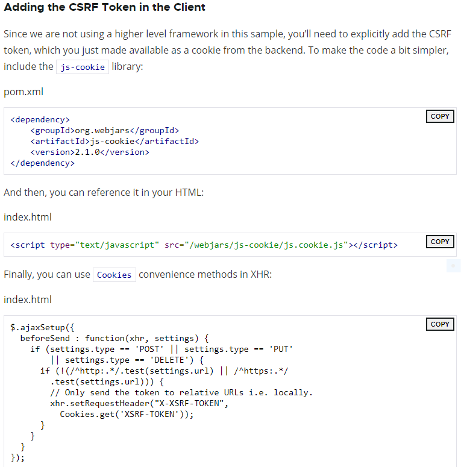
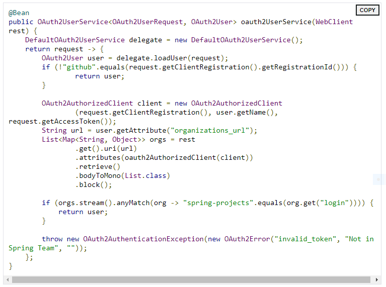

# Read: 17 - Spring Authorization

## Read (no need to do) this tutorial on OAuth

- Make a homepage
  - Start with spring initalizr
  - Create index in static folder
  - Copy down necessary dependencies
- Secure the application with Github and Spring Security
  - Add Spring Security as a dependency
  - Configure your app to use Github as the authentication provider
    - Add a New GitHub app
    - Configure application.yml
    - Boot up the application
- To link to GitHub add following to ```application.yml```





- The /user Endpoint
  - Now, you’ll add the server-side endpoint just mentioned, calling it /user. It will send back the currently logged-in user, which we can do quite easily in our main class
- Add a Logout Button
  - Add button in html
  - Then provide logout function



- Adding a logout endpoint
- Adding CSRF Token in the Client
  - Include js-cookie library into dependencies
  - Reference in HTML
  - Then use cookies convenience methods



- Adding Error Page for Unauthenticated Users
  - Add informative error message
  - Add a call to the ```/error``` endpoint, populating the ```<div>``` with the result
- Generate a 401 response in Server



[Back to README](README.md)
