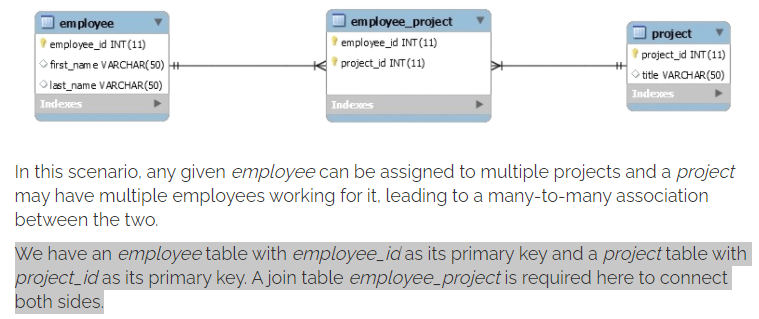

# Read: 18 - Web App Security

## Many to many relationships

- Typical many-to-many example:

- Database setup with employee and project tables along with the employee_project join table with employee_id and project_id as foreign keys:
  - [Link to Database Setup Image Example](https://www.baeldung.com/hibernate-many-to-many#setup)
- The model classes Employee and Project need to be created with JPA annotations:
  - [Link to Mode Class Setup Image](https://www.baeldung.com/hibernate-many-to-many#model)
  - Both the Employee class and Project classes refer to one another, which means that the association between them is bidirectional.
  - This association has two sides i.e. the owning side and the inverse side.
- Execution: In order to see the many-to-many annotation in action, we can write the following JUnit test:
  - [Link to the Execution Example](https://www.baeldung.com/hibernate-many-to-many#execution)

## Security: a humorous overview

- People feel genuine anxiety when asked if they want large fries for just 50 cents more, so I doubt that unfathomable lattice-based calculus is going to be a hit with the youths.

[Back to README](README.md)
