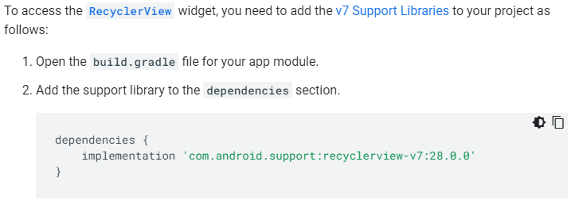

# Read: 28 - RecyclerView

## RecyclerView for displaying lists of data

- ``RecyclerView`` is a widget which displays a scrolling list of elements based on large data sets.
  - This widget is more advanced and flexible version of ListView
  - Overall container for the user interface
- View Holder objects
  - Defined by extending ``RecyclerView.ViewHolder``
  - Each view holder is in charge of displaying a single item with a view.
  - View holder objects are managed by a adapter, which is created by extending ``RecyclerView.Adapter``
- Adding the support library to dependencies

[Back to README](README.md)
