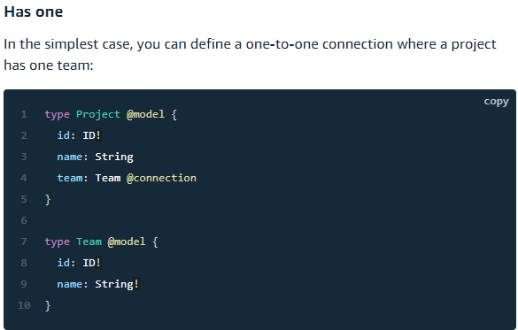
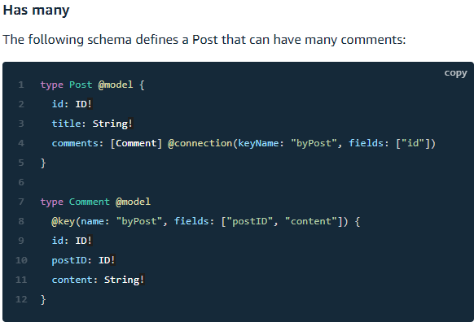
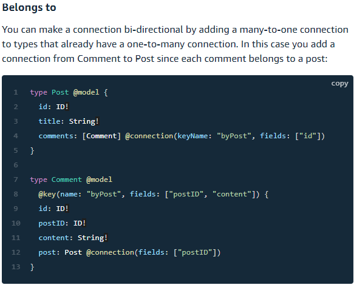
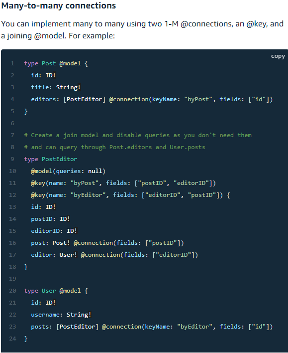

# Read: 33 - GraphQL @connection

## GraphQL @connection section

- The @connection directive enables you to specify relationships between @model types.
  - Currently, this supports one-to-one, one-to-many, and many-to-one relationships.
  - ```directive @connection(keyName: String, fields: [String!]) on FIELD_DEFINITION```
- Example of all connections
- One to One


- One to Many


- Many to One


- Many to Many


[Back to README](README.md)
