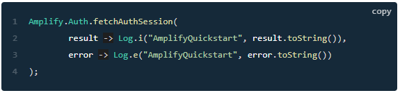

# Read: 34 - Amplify with Cognito for Login

## Amplify and Cognito

- The Amplify Auth category provides an interface for authenticating a user.
- Steps for implementing Amplify Auth
  - Execute command: ```amplify add auth```
  - Push changes to the cloud: ```amplify push```
  - Add following dependency to build.gradle file: ```implementation 'com.amplifyframework:aws-auth-cognito:1.4.1'```
  - Add following lines to prerequisites section:
    - ```Amplify.addPlugin(new AWSCognitoAuthPlugin());```
    - ```Amplify.configure(getApplicationContext());```
  - Run lines from Main Activity’s onCreate method


[Back to README](README.md)
