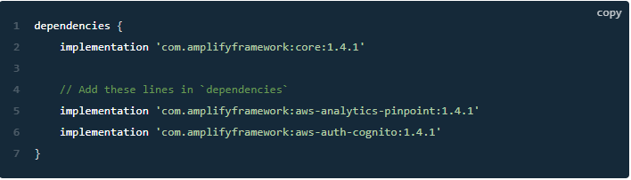
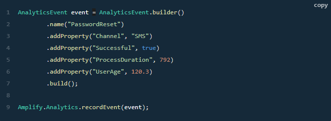

# Read: 39 - Kinesis

## Amplify and Kinesis

- Analytics category enables you to collect analytics data for your App.
- Steps to setup and configure your application with Amplify Analytics
  - Run command in terminal : ```amplify add analytics```
  - Answer to next three questions: Amazon Pinpoint, 'providePinPointResrouceName', Yes
  - Run command in terminal: ```amplify push```
  - Install dependencies



  - Add the following categories:
    - ```Amplify.addPlugin(new AWSCognitoAuthPlugin());```
    - ```Amplify.addPlugin(new AWSPinpointAnalyticsPlugin(this));```
  - To record an event, create an AnalyticsEvent and call Amplify.Analytics.recordEvent() to send it



  - Run command in terminal: ```Amplify console analytics```
  
- [Attribution link and for more instructions on steps](https://docs.amplify.aws/lib/analytics/getting-started/q/platform/android#initialize-amplify-analytics)

[Back to README](README.md)
